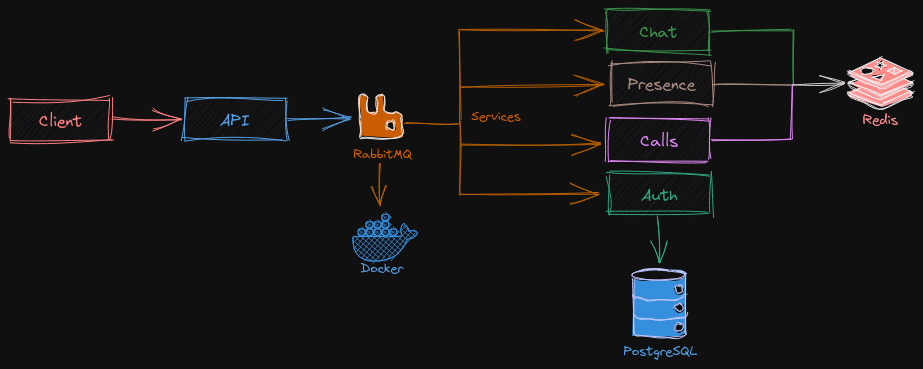

# 💬 Messenger

  

## ✏️ Description

Welcome to Messenger! 🎉 A stunning clone of popular messaging applications, Messenger aims to enhance your communication experience. With Messenger, you can send messages, create chat groups, and engage in real-time conversations with friends and colleagues. ✉️💬💪

## 🚀 Features

1. **User Registration and Authentication**: 🔑
   - Securely register and authenticate users to safeguard their accounts and data.
2. **User Profile Management**: 👤
   - Easily manage your user profile, update information, and personalize your Messenger experience.
3. **Messaging Functionality**: 💬
   - Send messages to individuals and enjoy seamless, real-time conversations with instant message delivery.
4. **Group Chat**: 👥
   - Create and participate in group chats, allowing you to collaborate with multiple users simultaneously.
5. **Real-Time Notifications**: 🔔
   - Receive instant notifications for new messages, ensuring you never miss an important conversation.
6. **Security and Privacy**: 🔒
   - Protect your privacy and ensure the confidentiality of your messages through robust security measures.
7. **Error Handling and Logging**: ⚠️
   - Handle errors gracefully and maintain detailed logs to facilitate effective troubleshooting and issue resolution.
8. **Testing and Quality Assurance**: ✅
   - Thoroughly test the application to deliver a high-quality and bug-free user experience.
9. **Deployment and Scalability**: ☁️
   - Deploy Messenger seamlessly and scale it efficiently to accommodate growing user demands.

## 💻 Installation

To get started with Messenger, follow the steps outlined in the [Installation Guide](./docs/InstallS.md). It provides detailed instructions to help you set up Messenger on your preferred platform.

## 🙌 Contributing

We value your contributions! If you would like to contribute to Messenger, please follow these steps:

1. Fork the repository.
2. Create a new branch: `git checkout -b feature/your-feature`.
3. Make your changes and commit them: `git commit -m 'Add your feature'`.
4. Push to the branch: `git push origin feature/your-feature`.
5. Open a pull request to have your changes reviewed and merged.

## 📄 License

Messenger is licensed under the [MIT License](LICENSE). Feel free to use and modify the codebase according to the terms of the license.

## ✉️ Contact

For any inquiries or support, please reach out to the [Repo Master](mailto:mohanadfteha@gmail.com). We're here to assist you and provide any necessary guidance.

Thank you for choosing Messenger! 🙏 Start connecting with your friends and colleagues today! 🚀💙

